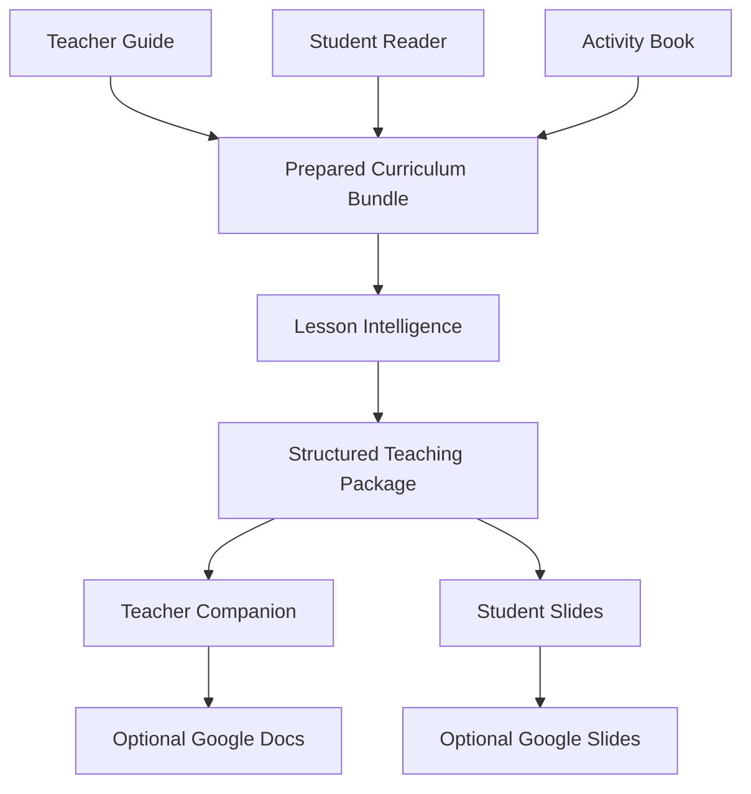

# TeacherOS Teacher Companion Implementation Contract

## Purpose

TeacherOS produces a source-grounded teaching package: a detailed Teacher
Companion and a synchronized student-facing slide model. These outputs organize
and explain the adopted curriculum; they do not replace or redesign it.

## Current Architecture

TeacherOS contains two backward-compatible paths:

1. The original `TeacherOS.generate_lesson()` pipeline prepares curriculum,
   invokes staged generators, validates a lesson, and emits renderer-neutral,
   Gamma, and Google Slides prompt artifacts. The v0.2 web interface uses this
   path.
2. Curriculum Intelligence registers and extracts local curriculum resources
   into SQLite, builds a `PreparedCurriculumSourceBundle`, derives the
   `CanonicalLesson`, instruction plan, relationship graph, and
   `LessonIntelligencePackage`, then renders deterministic Markdown and a
   Google Slides prompt.

The structured teaching-package path is additive to path 2:

`LessonIntelligencePackage` is the most structured object before rendering.
The new builder consumes it directly together with its prepared bundle. Local
renderers never parse existing Markdown and never call a model.

## Source Hierarchy

1. The Teacher Guide controls sequence, agenda, timing, objectives, materials,
   questions, required activities, assessments, wrap-up, and homework.
2. The Student Reader supplies assigned text, page evidence, and quotations
   only when the registered source is available.
3. The Activity Book supplies student tasks and publisher answers only when
   exact activity ownership and answer-key matching are established.
4. TeacherOS analysis is supplemental and must be labeled.
5. Teacher-entered content, when supported in the future, must remain labeled.

Missing information stays unavailable. A renderer, publisher, or adaptation
step may not infer absent page mappings, quotations, answers, facts, or assets.

## Curriculum Fidelity

- Preserve every required agenda item and its official order.
- Preserve official objective wording and all cognitive demands, conditions,
  modalities, evidence requirements, and scope.
- Preserve required question wording and stable identity.
- Never display publisher answers in student-visible content.
- Never present generated guidance as publisher content.
- Never insert a generated activity into the official agenda.
- Required unsupported resources are errors. Optional or teacher-supplied
  unavailable resources are warnings.

## Language Simplification

Language may be simplified. Meaning, rigor, scope, and instructional intent may
not be changed.

Every adaptation retains:

- actor;
- action;
- content;
- cognitive demand;
- conditions;
- scope;
- official wording;
- source references;
- transformation classification;
- confidence and review state.

If a safe simplification cannot be established deterministically, preserve the
official wording and add a separately labeled explanation.

## Content Classifications

Every important field uses one of:

- `exact_publisher_content`;
- `close_publisher_paraphrase`;
- `student_friendly_adaptation`;
- `model_generated_analysis`;
- `teacher_entered_content`;
- `unavailable`.

Teacher-facing analysis and ELD support are never publisher content unless
their source classification and citations prove otherwise.

## Output Architecture

Local generation writes:

- `teaching_package.json`;
- `teacher_companion.json`;
- `teacher_companion.md`;
- `student_slides.json`;
- `student_slides.md`;
- `teaching_package_validation.json`;
- `teaching_package_validation.md`.

The teaching package is authoritative. Markdown and Google outputs are
deterministic renderings. Generated output remains ignored by Git.

## Validation

Critical validation errors stop final artifact publication. Validation covers
agenda order and coverage, objective preservation, required questions,
resource provenance, page references, student-visible answers, unique stable
IDs, slide coverage, and internal synchronization. Warnings identify density,
missing optional information, unavailable teacher-supplied assets, and content
requiring teacher review.

## Caching

The cache identity includes the source bundle digest, Lesson Intelligence
package digest, teaching-package schema version, builder version, adaptation
prompt version, deterministic model version, and transformation settings.
Corrupt or mismatched caches are ignored. No credential or source text is
written into cache metadata beyond the already approved generated artifact.

## Publishing

Local generation never requires Google credentials. Google Docs and Google
Slides publishing are explicit optional commands. Publishers reuse the existing
desktop OAuth token architecture, save no credentials in output metadata, and
return only safe document or presentation identity and URLs.

## Compatibility

The feature does not rename or replace CanonicalLesson, prepared bundles,
Lesson Intelligence, Gamma artifacts, renderer prompts, current CLI commands,
existing web routes, or Lesson 9 stopping rules. Existing generated lessons
remain readable.

## Known Limitations

- Deterministic adaptation favors fidelity over aggressive simplification.
- Theme and literary analysis remain absent when source-supported analysis is
  not present in Lesson Intelligence.
- Teacher-supplied maps and other unavailable assets remain placeholders.
- Lesson 9 remains blocked until the “Selfie” excerpts receive verified source
  coordinates.
- Google publishing requires user-configured APIs and OAuth credentials.
