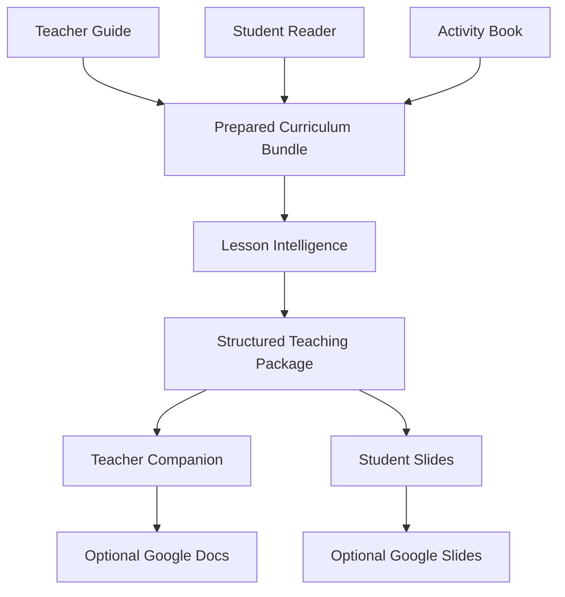

# TeacherOS

TeacherOS is an extensible instructional-design system that transforms curriculum evidence into structured, classroom-ready lesson packages. Its deterministic orchestration layer now connects the Curriculum Library and saved lesson indexes to a validated instructional-pipeline handoff.

## Security and content boundaries

TeacherOS is a **local-only application**. The Python API binds to
`127.0.0.1` and is intended to be used only with the local web interface at
`http://localhost:3000` or `http://127.0.0.1:3000`. Do not expose port 8765
through a public host, tunnel, container port, or reverse proxy.

Users must supply curriculum and instructional resources they are authorized
to access and process. Do not commit curriculum PDFs, trade books, pasted
curriculum, student information, generated lesson packages, or presentation
exports. Third-party trade-book content is explicitly excluded from this
repository. See [CONTENT_LICENSES.md](CONTENT_LICENSES.md) for the software
and curriculum licensing boundaries.

Copy `.env.example` to `.env`, add only local credentials, and restrict the
file to the current user. Gemini and OpenAI keys are read by the Python
backend only; they are never sent to the frontend. Keep Google OAuth client
files and tokens in ignored local files such as `credentials.json` and
`token.json`.

## Instructional generation pipeline

`TeacherOS.generate_lesson(...)` executes the Curriculum Reader, Curriculum Analyzer, Instruction Designer, Presentation Designer, Lesson Assembler, Lesson Validator, and existing Lesson Package parser. Each AI stage uses the official OpenAI Python SDK Responses API with a Pydantic structured output. The model is configured once with `TEACHEROS_MODEL` (default: `gpt-5-mini`); the API key is read only from `OPENAI_API_KEY`.

Copy `.env.example` into your preferred secret-management workflow and export
the variables in your shell. TeacherOS does not commit secrets automatically.
Never put a real value in `.env.example`.

First validate the real curriculum input and planned workflow without making an API call:

```bash
python -m app.cli generate-lesson \
  --curriculum CKLA --grade 8 --unit 1 --lesson 1 --dry-run
```

Then generate when `OPENAI_API_KEY` is configured:

```bash
python -m app.cli generate-lesson \
  --curriculum CKLA --grade 8 --unit 1 --lesson 1
```

Human-readable stage files are saved under `output/generation_runs/<request_id>/`. A failed run preserves completed files. Running the same command resumes from every valid saved stage; use `--no-resume` to deliberately regenerate all AI stages. Automated tests mock all OpenAI calls and never make paid requests. Generation does not render Google Slides.

## TeacherOS v0.1 interface

The responsive interface in `web/` browses the registered curriculum library,
shows unit and lesson details, and starts the existing generation pipeline in a
background thread. The local bridge in `app/interface_server.py` reports live
progress by observing the normal stage artifacts; it does not replace or alter
the generation engine. Version 0.2 adds a Gamma-specific `GammaDeckPrompt.md`
adapter alongside the unchanged renderer-neutral bundle. Setup and launch
instructions are in `web/README.md`.

Generated lesson metadata carries this attribution: “This work is based on an original work of the Core Knowledge Foundation made available under a Creative Commons Attribution-NonCommercial-ShareAlike 4.0 International License. This does not imply endorsement by the Core Knowledge Foundation.” This attribution does not apply the CKLA license to independently published trade-book text.

Retained CKLA-derived configuration is modified for deterministic curriculum
mapping and is available only for noncommercial use under CC BY-NC-SA 4.0.
The license requires attribution, a link to the license, an indication of
changes, and ShareAlike distribution. Independently published trade-book
content is not included.

## Lesson preparation orchestration

`TeacherOS.prepare_lesson(...)` is the application entry point for preparing one registered lesson. It retrieves the curriculum record, loads the existing saved index, selects the requested lesson, extracts only its exact Teacher Guide pages, copies the already-indexed metadata, validates the handoff, and writes human-readable JSON under `output/pipeline_inputs/`.

```bash
python -m app.cli prepare-lesson \
  --curriculum CKLA \
  --grade 8 \
  --unit 1 \
  --lesson 1
```

The predictable output name is `ckla_grade_8_unit_1_lesson_1_pipeline_input.json`. It contains request metadata, exact Teacher Guide text, title, objectives, standards, materials, homework, duration, Reader and Activity Book references, assessment and PDF page references, source references, and extraction warnings. Unavailable curriculum metadata remains empty or null and is reported as a warning; TeacherOS never invents it.

Preparation returns `completed`, `completed_with_warnings`, or `failed`. The CLI prints warnings and exact failing stages, and returns exit code 2 for failures such as an unregistered unit, missing source PDF or index, corrupt/mismatched index, unknown lesson, extraction failure, or invalid output location.

Preparation is not lesson generation. It makes no AI calls, changes no instructional content, and creates no slides. It establishes the validated input boundary for the Curriculum Reader, Analyzer, Instruction Designer, Presentation Designer, and Lesson Assembler.

```text
Lesson request
    ↓
TeacherOS orchestrator
    ↓
Curriculum Library
    ↓
Curriculum Index
    ↓
LessonSource and metadata
    ↓
Validated pipeline input JSON
    ↓
Existing TeacherOS instructional pipeline
    ↓
Lesson Package
    ↓
Parser
    ↓
Google Slides renderer
```

## Curriculum Library and Lesson Locator

The Curriculum Library registers local paths and metadata for a curriculum unit's Teacher Guide, Student Reader, and Activity Book in SQLite. It does not copy or read the source files. The PDF extractor reads only the registered Teacher Guide, keeps zero-based PDF page coordinates and one-based display page numbers, and flags pages with little or no usable text. OCR is intentionally not attempted.

The CKLA locator searches for real lesson boundaries using several signals: exact standalone lesson headings, heading placement, a nearby title, contents-page context, and increasing lesson order. It rejects table-of-contents entries and inline references, supports multi-digit lesson numbers, and saves confidence and warnings with every result. The generated human-readable JSON index can be reused without rescanning the guide. Extracting a lesson rereads only the indexed page range and returns the curriculum text without summarizing or rewriting it.

Keep curriculum PDFs in a private local location, optionally under `data/curriculum/`. SQLite metadata is stored at `data/curriculum/library.sqlite3`, and indexes are stored under `data/indexes/`. These local files, generated presentations, and common OAuth credential files are ignored by Git.

Register and inspect a unit with:

```bash
python -m curriculum.cli register \
  --curriculum CKLA --grade 8 --unit 1 \
  --unit-title "Unit title" \
  --teacher-guide "/private/curriculum/teacher-guide.pdf" \
  --student-reader "/private/curriculum/student-reader.pdf" \
  --activity-book "/private/curriculum/activity-book.pdf"

python -m curriculum.cli index --grade 8 --unit 1
python -m curriculum.cli list-lessons --grade 8 --unit 1
python -m curriculum.cli extract-lesson \
  --grade 8 --unit 1 --lesson 6 \
  --output output/grade8_unit1_lesson6.txt
```

All commands default to curriculum name `CKLA` after registration. Use `--curriculum` for another registered name. `index`, `list-lessons`, and `extract-lesson` also accept `--index-file`; `index` accepts `--override`.

For an uncertain or missed boundary, create a private JSON override file. Page values are zero-based PDF page numbers:

```json
{
  "lessons": {
    "6": {
      "start_pdf_page": 42,
      "lesson_title": "Optional corrected title"
    }
  }
}
```

Then rebuild the index:

```bash
python -m curriculum.cli index --grade 8 --unit 1 --override /private/curriculum/overrides.json
```

The end-to-end pipeline is:

```text
Curriculum files
    ↓
Curriculum Library
    ↓
PDF Text Extractor
    ↓
Lesson Locator
    ↓
Curriculum Index
    ↓
Requested LessonSource
    ↓
Existing TeacherOS brain
    ↓
Lesson Package
    ↓
Parser
    ↓
Google Slides renderer
```

`LessonSource` is the future handoff to the existing TeacherOS brain. This milestone stops at exact source retrieval: it makes no instructional decisions, does not call an AI service, and does not generate slides.

Curriculum materials may be copyrighted and can contain sensitive annotations. Store source PDFs and manual overrides outside public repositories, restrict filesystem access, and share only where licensing permits. Never commit OAuth credentials, local indexes derived from copyrighted works, or generated presentations containing protected content.

## Milestone 3 scope

- Pydantic models and a stable schema boundary for renderer-ready lessons.
- A deterministic Google Slides renderer using the Slides and Drive APIs.
- Editable 16:9 slides, fixed educational layouts, and speaker notes.
- Automated schema and mocked renderer tests.
- A deterministic parser for structured JSON Lesson Packages.
- Package-level checks for metadata, slide titles and notes, unique slide IDs, ordering, and timing.

The parser and renderer make no instructional decisions and contain no AI or lesson-generation behavior. The parser only renames and validates supplied fields; the renderer maps only validated `Lesson` and `Slide` fields to presentation objects.

## Architecture

1. The existing pipeline reads and analyzes curriculum, designs instruction and slides, and assembles a structured Lesson Package.
2. `brain/lesson_package_parser.py` validates package completeness and transforms it into the existing `Lesson` object.
3. `schemas/lesson_schema.py` exposes the validated contract, and `models/` owns the unchanged domain models.
4. `renderer/` owns delivery adapters. The unchanged Google Slides adapter receives the `Lesson` object and maps it to editable API objects.
5. `lesson_packages/` stores structured JSON inputs; `output/` is reserved for exports.

The data flow is:

```text
Lesson Package → Lesson Object → Renderer → Google Slides
```

A Lesson Package contains `lesson_metadata`, an explicit `slide_order`, slide records, and lesson-level vocabulary, activities, assessments, and homework. Slide records contain visible content, bullets, speaker notes, teacher directions, timing, materials, image prompts, and source references. The parser accepts either an in-memory mapping or a `.json` path. It never reads PDFs, invokes AI, rewrites, or summarizes lesson content.

```python
from brain.lesson_package_parser import parse_lesson_package
from renderer.google_slides_renderer import GoogleSlidesRenderer

lesson = parse_lesson_package("lesson_packages/lesson_1.json")
presentation = GoogleSlidesRenderer().create_presentation(lesson)
```

## Setup and testing

TeacherOS targets Python 3.12.

```bash
python3 -m venv .venv
source .venv/bin/activate
python -m pip install -r requirements.txt
pytest
```

`requirements.in` records direct Python dependencies and `requirements.txt`
pins the complete tested environment. The software is licensed under
AGPL-3.0-only because the current PDF implementation uses the AGPL-licensed
PyMuPDF distribution. See `LICENSE` and `CONTENT_LICENSES.md`.

## Google Cloud and OAuth setup

1. Create or select a project in the [Google Cloud Console](https://console.cloud.google.com/).
2. Configure the OAuth consent screen. While the app is in testing, add each teacher account as a test user.
3. In **APIs & Services → Library**, enable both **Google Slides API** and **Google Drive API**.
4. In **APIs & Services → Credentials**, create an OAuth client ID with application type **Desktop app**.
5. Download the client file, keep it outside version control, and provide its path to the renderer.

On first authentication, a browser opens for consent. The renderer saves the OAuth token at `token_path` (default `token.json`) and refreshes it when possible. Never commit either credential file. The Slides scope permits presentation editing; `drive.file` permits access to presentations TeacherOS creates and exports.

OAuth authentication occurs locally. OAuth tokens are not returned by the
TeacherOS API or exposed to the browser. TeacherOS does not add public,
domain-wide, or link-sharing permissions: newly created Google documents and
presentations remain private to the authenticated account unless that user
later changes sharing in Google Drive.

```python
from renderer.google_slides_renderer import GoogleSlidesRenderer

renderer = GoogleSlidesRenderer(
    credentials_path="/secure/path/google-oauth-client.json",
    token_path="/secure/path/teacheros-token.json",
)
renderer.authenticate()
presentation = renderer.create_presentation(lesson)
renderer.export(presentation, "output/lesson.pptx")  # .pdf also supported
print(presentation["url"])
```

The Google Slides API creates native text boxes, fixed layouts, and speaker notes. The Google Drive API exports the native deck to `.pptx` or `.pdf`. All visible slide content remains editable text.

Once `07_validated_lesson.json` exists, create a new editable presentation without rerunning lesson generation:

```bash
python -m app.cli create-slides \
  --curriculum CKLA \
  --grade 8 \
  --unit 1 \
  --lesson 1
```

The command validates the saved lesson, checks its identity against the request, and passes it directly to `GoogleSlidesRenderer`. It does not invoke the instructional pipeline or OpenAI.

## Validation

The parser rejects missing lesson metadata, slide titles, speaker notes, duplicate slide IDs, inconsistent slide order, and invalid timing. Pydantic then validates the complete `Lesson` object. The renderer rejects unknown layouts before creating a presentation, permits title-only slides, preserves long text while reducing its font size, and creates stable API-safe object IDs.

## Future roadmap

- Emit structured JSON Lesson Packages from the existing CKLA curriculum pipeline.
- Add integration tests in an isolated Google Workspace test account.
- Add retry/backoff, API error translation, revision tracking, and observability.
- Add application entry points, secure deployment credential management, and teacher approval workflows.
- Add lesson-package schema versioning and migrations.

Google credentials and generated files must never be committed to source control.
# TeacherOS

## Presentation Designer

The generation pipeline runs Reader → Analyzer → Instruction Designer → Presentation Designer → Lesson Assembler → Validator → Presentation Renderer Prompt Generator → renderer handoff. The Presentation Designer accepts the instructional design plus relevant reader/analyzer context and writes `04_presentation_design.json`. The assembler then writes `05_lesson_package.json`, validation writes `06_validation_report.json`, and only after validation succeeds the deterministic prompt generator writes `RendererPromptBundle.json` and the copy-friendly `RendererPromptBundle.md`. The parsed renderer handoff remains `07_validated_lesson.json`.

The prompt generator consumes the validated `PresentationDesignOutput` directly and emits both a complete-deck prompt and synchronized per-slide prompts. It preserves the exact schema payload—including separate student content and teacher notes, visual and image directions, interaction, layout, timing, sources, and fidelity—and never asks a renderer to redesign the lesson. Renderer-specific phrasing is selected with `RendererType`; the serialized lesson data remains identical for generic, Gemini, Gamma, and future adapters.

The renderer-neutral master visual design system is stored in `prompts/presentation_design_guide.md`. The generator injects it once near the beginning of every complete deck prompt; it is not repeated in the per-slide prompts.

Presentation design separates projected `student_view` content from detailed `teacher_notes`, and gives every slide structured `design`, `visuals`, `interaction`, timing, materials, sources, and fidelity metadata. The deterministic Grade 8 theme is in `config/presentation_theme.json`; models choose semantic layouts, while fonts, sizes, colors, margins, and content limits stay in configuration. The assembler still adapts rich slides into the established lesson-package contract for downstream compatibility, while the Google Slides renderer consumes `04_presentation_design.json` directly on new runs.

## Rich Google Slides rendering

`create-slides` now prefers `04_presentation_design.json` and falls back to `07_validated_lesson.json`. The renderer dispatches the controlled semantic layouts directly, applies the deterministic theme, limits visible text without reducing it below the readable minimum, and writes structured teacher guidance and CKLA attribution to editable speaker notes. Only student-facing fields and concise interaction cues are projected.

Required visuals without an approved Google-accessible asset render as neutral native placeholders and produce structured warnings. Development mode may expose the short visual description, but never the image prompt or a local path. TeacherOS does not download images, extract trade-book art, or apply CKLA licensing to trade-book material. The supported semantic layouts are `title_hero`, `day_divider`, `split_visual`, `question_focus`, `quote_focus`, `map_focus`, `vocabulary_cards`, `three_card`, `reading_checkpoint`, `discussion_prompt`, `activity_steps`, `comparison`, `evidence_chart`, `exit_ticket`, `minimal_text`, and `no_visual`.

Run renderer tests with `PYTHONPATH=. .venv/bin/pytest -q Tests/test_google_slides_renderer.py Tests/test_create_slides_cli.py`. A seven-layout offline Lesson 1 sample is available at `Tests/fixtures/sample_lesson_1_presentation_design.json`. With Google OAuth configured, render a generated lesson using `python -m app.cli create-slides --grade 8 --unit 1 --lesson 1`.

Run all tests with `PYTHONPATH=. .venv/bin/pytest`. Run one generation with `python -m app.cli generate-lesson --grade 8 --unit 1 --lesson 1` (an API key and registered curriculum files are required).

## Structured teaching packages

TeacherOS can now build an optional, deterministic teaching package from the
existing prepared curriculum bundle and `LessonIntelligencePackage`. It does
not change CanonicalLesson, the existing generation pipeline, Gamma artifacts,
or the existing Google Slides prompt.



Generate Lesson 1 locally without Google credentials:

```bash
PYTHONPATH=. python -m curriculum.intelligence.generate_teaching_package \
  --lesson 1 \
  --output output/lesson_001
```

The command writes `teaching_package.json`, Teacher Companion JSON/Markdown,
student-slide JSON/Markdown, and validation JSON/Markdown. It reuses a valid
saved package when source, Lesson Intelligence, schema, builder, adaptation,
and deterministic-model identities are unchanged. Use `--no-resume` to rebuild.
Critical fidelity errors write validation diagnostics and block final companion
and slide artifacts.

Optional Google publishing uses the existing desktop OAuth approach. Enable
Google Docs, Google Slides, and Google Drive APIs, then run:

```bash
PYTHONPATH=. python -m curriculum.intelligence.publish_teacher_companion \
  --input output/lesson_001/teacher_companion.json

PYTHONPATH=. python -m curriculum.intelligence.publish_student_slides \
  --input output/lesson_001/teaching_package.json
```

Publishing saves only document or presentation IDs and URLs in
`publishing_metadata.json`. Credentials and tokens remain outside generated
metadata and version control. The curriculum constitution, fidelity contract,
source hierarchy, validation behavior, cache rules, and current limitations
are documented in `Docs/teacher_companion_spec.md`.
